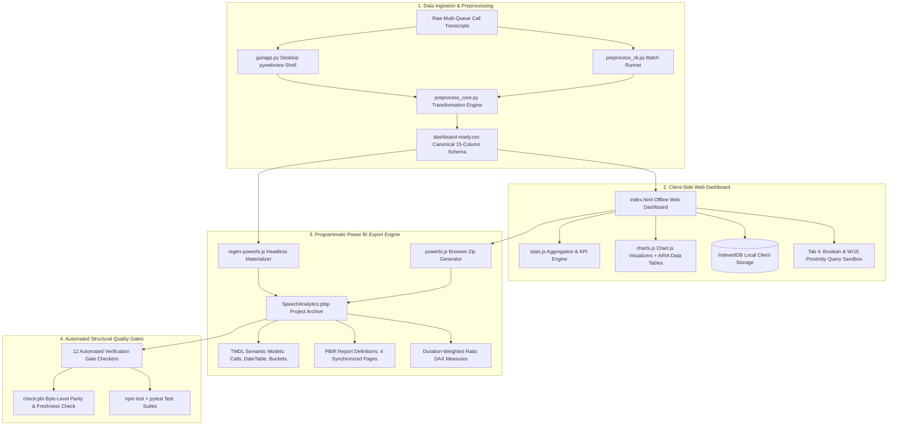

# Speech Analytics & Customer Intelligence Platform (Portfolio Edition)

[](https://www.python.org/)
[](https://nodejs.org/)
[](https://powerbi.microsoft.com/)
[]()
[]()

A production-grade, full-stack speech analytics and contact center intelligence system. Designed as a corporate-sanitized portfolio showcase, this repository demonstrates end-to-end analytics engineering across three integrated tiers: a **pure Python transformation preprocessor** (CLI & `pywebview` desktop shell), an **offline-ready client-side web analytics dashboard** (IndexedDB & Chart.js), and a **programmatic Microsoft Power BI project generator** (`.pbip` with TMDL semantic modeling and PBIR report layout definitions).

---

## 🏗️ System Architecture



---

## 📊 Canonical 15-Column Schema

The core preprocessor validates, standardizes, and enriches contact center call records into an authoritative 15-column schema:

| Column Name | Data Type | Description |
|---|---|---|
| `Timestamp` | `DATETIME` | Call initiation timestamp (`YYYY-MM-DD HH:MM:SS`) |
| `Contact_ID` | `STRING` | Unique anonymized interaction reference ID |
| `Agent_ID` | `STRING` | Normalized customer service representative identifier |
| `Queue_Name` | `STRING` | Support channel routing queue |
| `Call_Duration (s)` | `INTEGER` | Total call duration in seconds |
| `Silence_Duration (s)` | `INTEGER` | Cumulative dead-air and hold time in seconds |
| `Silence_Pct` | `FLOAT` | Silence proportion of call duration (`0.0%` - `100.0%`) |
| `Max_Agitation_Score` | `INTEGER` | Acoustic customer stress / agitation peak (`0` - `100`) |
| `Primary_Category` | `STRING` | Primary contact driver category |
| `Customer_Sentiment` | `INTEGER` | Composite linguistic sentiment score (`-100` to `+100`) |
| `Agent_Quality` | `INTEGER` | Evaluated agent quality assurance score (`0` - `100`) |
| `Compliance_Risk` | `STRING` | Risk classification (`No Risk`, `Medium Risk`, `High Risk`) |
| `Empathy_Score` | `INTEGER` | Linguistic empathy rating index (`0` - `100`) |
| `FCR_Flag` | `BOOLEAN` | First Contact Resolution binary indicator (`0` or `1`) |
| `Call_Summary_Transcript` | `STRING` | Sanitized natural-language transcript summary snippet |

---

## 🌟 Key Technical Differentiators

### 1. Offline-First, Zero-Auth Web Dashboard
- **Zero CDN Dependencies**: All core libraries (`PapaParse`, `Chart.js`, `JSZip`) are vendored locally in `vendor/` for instant, offline, deterministic loading without third-party tracking.
- **Client-Side Persistence**: Browser-local `IndexedDB` caching allows users to upload custom CSV datasets, switch datasets, or restore defaults without a web server.
- **WCAG 2.1 AA Accessibility**: Hidden screen-reader accessible data tables (`<table summary="...">`) are dynamically paired with every chart canvas, ensuring visual dashboards meet enterprise accessibility standards.

### 2. 4-Tab Specialized Analytical Command Centers
- **Tab 1: Executive Summary Hub**: High-level KPI summary cards, dual-axis Call Volume & Sentiment timeline, Category Distribution stacked bar, and automated incident narrative callouts.
- **Tab 2: Ops & QA Command**: Silence % vs. QA Score scatter plot, Queue Efficiency Leaderboard, Conversational Balance (Talk vs. Silence) doughnut, and Silence Duration frequency histogram (5 discrete buckets).
- **Tab 3: Compliance & Coaching**: Verification adherence gauge, 5-axis Agent Behavioral radar chart, Interaction Agitation stress curve, and Linguistic Empathy correlation bar chart.
- **Tab 4: Speech Analytics NLP Query Sandbox**: Live Boolean (`AND`, `OR`, `NOT`) and Proximity (`W/15`) query parser evaluating customer transcripts in real-time, computing Precision & Recall, and highlighting matched search terms.

### 3. Programmatic Power BI Export Engine (.pbip / TMDL)
- Generates Microsoft Power BI Project (`.pbip`) directories directly inside the browser using client-side JavaScript.
- **TMDL Semantic Models**:
  - `Calls.tmdl`: Contains 21 model columns (15 source + 6 calculated columns) and 35+ DAX measures.
  - `DateTable.tmdl`: Continuous full-calendar-year dimension marked as a date table with day, month, quarter, and fiscal hierarchy.
  - `SilenceBuckets.tmdl` & `EmpathyBuckets.tmdl`: Discretized dimension tables joined with explicit 1:many relationships.
- **Mathematically Sound Duration-Weighting**: Implements ratio-of-sums DAX (`DIVIDE(SUM(Silence_Seconds), SUM(Duration_Seconds))`) rather than mathematically invalid row-averaged percentages (`AVERAGE(Silence_Pct)`).
- **PBIR Report Structure**: Emits 4 synchronized report pages, including a dedicated hidden Call Detail drill-through page with single-sourced PII exposure disclosure.

### 4. Automated Structural Quality Gates
The repository enforces 12 automated structural gate scripts verifying the integrity of the generated artifacts:
- `npm run check:pbi`: Byte-for-byte freshness check comparing generator output against the on-disk deliverable tree, verifying genuine 8-byte PNG headers (`0x89 0x50 0x4E 0x47 0x0D 0x0A 0x1A 0x0A`).
- `npm run check:date`: Asserts date table marking, calendar span, and foreign key cardinality.
- `npm run check:weighted`: Enforces ratio-of-sums formula shape on all weighted DAX measures.
- `npm run check:drill`: Verifies target drill-through field bindings and column ordering.
- `npm run check:columns`: Validates complete accounting of all 21 model columns.
- `npm run check:compliance`, `check:cards`, `check:narrative`, `check:pop`, `check:target`, `check:export`.

---

## 🚀 Quickstart & Usage

### 1. Client-Side Web Dashboard
Open `index.html` directly in any modern web browser, or launch a local static server:
```bash
# Python local server
python -m http.server 8080
# Open http://localhost:8080 in your browser
```

### 2. Desktop Preprocessor GUI & CLI
The companion desktop preprocessor runs headless or via a native `pywebview` window:
```bash
# Install Python dependencies
pip install -r requirements.txt

# Run Desktop GUI (requires WebView2 runtime on Windows)
python gui/app.py

# Or run Headless Batch CLI
python preprocess_cli.py --input raw_data.csv --output processed/dashboard-ready.csv
```

### 3. Power BI Project (.pbip)
1. Ensure Power BI Desktop has enabled Preview Features:
   - `File > Options and settings > Options > Preview features`
   - Check `Power BI Project (.pbip) save option`
   - Check `Store semantic model using TMDL format`
   - Check `Store reports using enhanced metadata format (PBIR)`
2. Open `powerbi/SpeechAnalytics.pbip` in Power BI Desktop.
3. When prompted, set the `CsvFolderPath` parameter to the folder containing `data/` to load data.

### 4. Running Test Suites
```bash
# Run Python Unit & Golden Parity Tests
pytest -q

# Run Power BI Test Suite & Structural Gate Checks
npm test
npm run check:pbi
npm run check:weighted
npm run check:drill
```

---

## 🛡️ Corporate Sanitization & Privacy

This repository is an engineered portfolio edition:
- **Zero Proprietary Branding**: All enterprise customer references and trade names have been replaced with white-label brand tokens ("Acme Analytics" & "OmniAnalytics Center of Expertise").
- **Zero Employee PII**: All agent and customer identifiers are anonymized (`AGENT_ALEX`, `AGENT_JORDAN`, etc.).
- **Synthetic Data Engine**: Transcripts and call metrics are synthesized via `generate_mock_data.py` to model contact center incident dynamics without exposing real proprietary communications.

---

## 📜 License
MIT License. Created for technical demonstration and portfolio evaluation.
